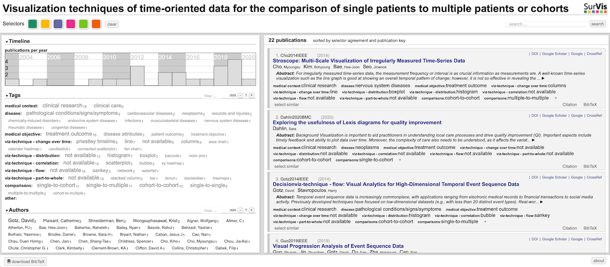

# Abstract

**Background:**
The visual analysis and delivery of data in the form of visualizations is of great importance in healthcare, as such forms of presentation can reduce errors and improve care, and can also help provide new insights into long-term disease progression. Information visualization and visual analytics also address the complexity of long-term, time-oriented patient data by reducing inherent complexity and facilitating focus on underlying and hidden patterns.

**Objective:**
Aim of this review is to give an overview of visualization techniques of time-oriented data in health care supporting the comparison of patients. We systematically collect literature and report on visualization techniques supporting the task of comparing time-based datasets of single patients with those of multiple patients or their cohorts, and summarize the usage of these techniques. Visualization techniques are grouped according to the medical characteristics and other relevant visualization aspects like data types, interactions and tasks.

**Methods:**
This scoping review used the PRISMA-ScR (Preferred Reporting Items for Systematic Reviews and Meta-Analyses Extension for Scoping Reviews) checklist. After all collected articles were screened by 16 reviewers according to the criteria, 6 reviewers extracted the set of variables under investigation. The characteristics of these variables were based on existing taxonomies or identified through open coding.

**Results:**
Out of 249 screened articles, we identified 22 fitting all criteria, and reviewed these in-depth. We collected and synthesized findings from these articles for medical aspects such as medical context, medical objective, and medical data type, as well as for the core investigated aspects of visualization technique, interaction technique, and supported tasks. The extracted articles were published between 2003 and 2019, and mostly situated in clinical research. The systems use a wide range of visualization techniques, most frequently showing some change over time. Timelines and temporal line charts occur eight times each, followed by histograms with seven occurrences and scatterplots with five. We report on the findings quantitatively through visual summarization, and qualitatively.

**Conclusions:**
The articles under review in general mitigate complexity through visualization and support diverse medical objectives. We identified three distinct patient entities: single patients, multiple patients, and cohorts. Cohorts typically are visualized in condensed form either through prior data aggregation or through visual summarization, whereas visualization of individual patients often contains finer details. All systems provide mechanisms to view and compare patient data. Explicitly comparing a single patient to multiple patients or a cohort, however, is supported only by a few systems. These systems mainly use basic visualization techniques with some employing novel visualizations tailored for a specific task. Overall, we found the visual comparison of measurements between single and multiple patients or cohorts to be underdeveloped, and argue for further research in a systematic review, and the usefulness of a design space.

# Companion Tool

<small>To provide readers with an interactive way of exploring the visualization systems from our scoping review, we created a visual literature browser using the SurVis software. Our tool not only provides a selection of attributes to see the use of specific visualization techniques but also enables cross-filtering to identify systems combining a set of attributes such as medical context, visualization, and patient entities.</small>

# Figures

_Click on the images to see the full version. We provide these images here, as they could not be included in the paper in high-resolution._

<small>Figure 2. Visualization techniques in the selected articles. Each dot indicates the existence of the technique in a system, with full saturated dots representing the application of the technique for the explicit task of comparison. References within the gray background were identified to support the comparison of multiple patients (single-to-cohort or single-to-multiple). Colors indicate the visualization category, with the bars on the right showing the distribution of the techniques. Bars at the bottom represent the number of techniques identified for each article. Techniques are sorted based on the number of occurrences, and articles are sorted based on the year of publication.</small>

<small>Figure 3. Identified tasks (actions and targets) in the included articles. The plot shows the tasks as actions (analyze, query, and search) and targets (all data, attributes, and network data) that could be completed by visualization systems presented in the articles in our selection. For the categorization of tasks, we used the taxonomy by Munzner [6]. Gray backgrounds indicate articles where patients (single-to-cohort or single-to-multiple) could be compared. Bars on the right-hand side represent the number of articles that used the displayed task category. </small>

<small>Figure 9. All possible combinations for comparing 1 measurement over time between different patient entities (single patient, multiple patients, and cohorts) in the case of line charts. For single and multiple patients, each line represents 1 measurement, whereas, for cohorts, the chart represents the mean and range. All combinations are shown in juxtapositioned and superpositioned layouts, with the colors supporting legibility in the latter.</small>
